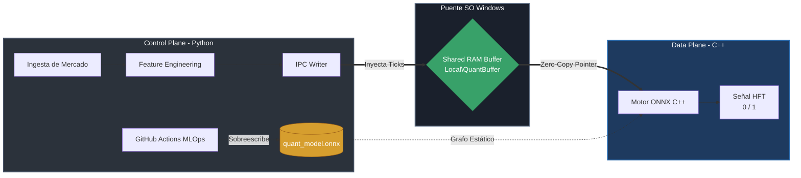

# Zero-Copy Quant Inference Engine

Motor de inferencia de baja latencia (HFT) diseñado para aislar la carga analítica de MLOps de la ejecución crítica en hardware. Desacopla Python y C++ mediante memoria compartida nativa, eliminando cuellos de botella de red y disco.

## Arquitectura Desacoplada

- **Data Plane (C++ / ONNX Runtime):** Ejecutable nativo anclado a un único hilo de CPU (`SetIntraOpNumThreads(1)`). Lee tensores en crudo inyectando punteros directamente a RAM (`MapViewOfFile`), pasando el contexto al grafo matemático estático sin latencia de I/O.
- **Control Plane (Python):** Orquestador asíncrono para ingesta de datos de mercado, feature engineering vectorizado masivo y escritura en el buffer IPC.



## Zero-Copy IPC
La sincronización entre lenguajes prescinde de TCP/IP o WebSockets. Se utiliza un bloque de memoria compartida (`windows.h` / `mmap`). Python inyecta los *ticks* de mercado directamente en la RAM física, donde el bucle de vigilancia en C++ los detecta y evalúa en microsegundos.

## MLOps Automatizado (CI/CD)
El ciclo de vida del modelo predictivo (XGBoost) se gestiona mediante infraestructura como código (IaC) vía **GitHub Actions**. Un *cronjob* semanal realiza un reentrenamiento ciego:
1. Ingesta el último histórico de mercado.
2. Aplica un particionado temporal estricto para evitar sesgo (*look-ahead bias*).
3. Evalúa la métrica de Precisión (True Positives) en la matriz de confusión.
4. Exporta y pushea automáticamente el nuevo binario `.onnx` al entorno de despliegue.

## Arranque del Sistema

```powershell
# Inicia el mapeo de RAM en Python y levanta el ejecutable de C++ sincronizado
.\start_pipeline.ps1
```
